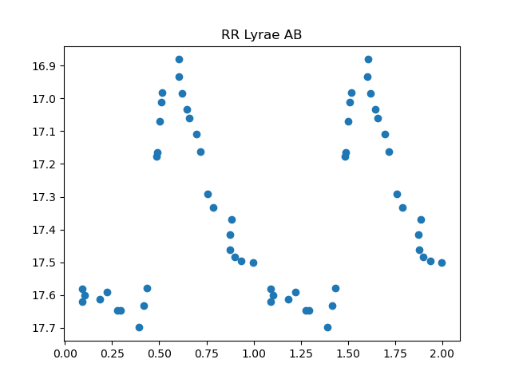

# SOM_lc
# Variable Star Classification with Self-Organizing Maps

This repository contains the Python code developed for my Master's thesis in Astrophysics, focused on the **classification of variable stars using Self-Organizing Maps (SOMs)**.

## Overview

The project investigates the use of **unsupervised machine learning** techniques to classify astronomical variable stars from their light curves.

The dataset consists of light curves extracted from **7 DECam fields toward the Large Magellanic Cloud**, observed with the DECam camera mounted on the **Victor M. Blanco 4-m Telescope** at Cerro Tololo Inter-American Observatory.

The main goal is to train a Self-Organizing Map to identify patterns in the light curves and evaluate its ability to distinguish different classes of variable stars.

## Main Workflow

The pipeline includes:

* Loading and preprocessing astronomical light curves
* Feature extraction and normalization
* Training of a **Self-Organizing Map**
* Visualization of the trained SOM
* Analysis of the **U-Matrix**
* Analysis of the neuron hit distribution
* Classification of variable-star classes
* Evaluation using **confusion matrices, completeness and purity**
* Visualization and analysis of classification results

## Variable Star Classes

The analysis includes several classes of astronomical sources, including:

* RR Lyrae (RRab, RRc)
* δ Scuti
* Classical Cepheids
* Type II Cepheids
* Eclipsing binaries (EA, EB, EW)
* Other variable sources

## Technologies

The project was developed mainly in **Python**, using:

* NumPy
* Matplotlib
* PyTorch
* Scikit-learn
* Custom Self-Organizing Map implementation
* FITS/astronomical data analysis tools

## `make_simul_lc.py`

Generates synthetic light curves for different classes of variable stars.

- Simulates RR Lyrae, Classical and Type II Cepheids, eclipsing binaries and microlensing events.
- Uses Fourier models and analytical profiles to reproduce different light-curve morphologies.
- Randomizes physical and photometric parameters such as period, amplitude, baseline magnitude and phase shift.
- Adds Gaussian photometric noise to simulate observational uncertainties.
- Generates 1000 light curves for each class and saves them as individual `.txt` files.
- Combines the simulated data into a shuffled CSV dataset used as input for the SOM classification.

## `main_lightcurve_SOM.py`

Main script for the classification of variable stars using a Self-Organizing Map (SOM).

- Loads simulated and DECam light-curve datasets and splits the simulated data into training, validation and test sets.
- Trains a 25×25 SOM with GPU support and optional early stopping, or loads a previously trained map.
- Generates U-Matrix maps to visualize the distribution of the different stellar classes.
- Builds probability maps for each class and uses them to classify new light curves according to their Best Matching Unit (BMU).
- Applies the trained SOM to the DECam dataset.
- Evaluates the classification using completeness, purity, TP, FP and FN.
- Produces plots of representative simulated and DECam light curves.

## Results

The SOM successfully identified several meaningful structures in the dataset, showing particularly good performance for:

* RR Lyrae stars
* RRc & δ Scuti stars
* Type II Cepheids
* Microlensing events

The classification of **classical Cepheids** and especially **eclipsing binaries** was more challenging due to the similarity between their light-curve features and the complexity of their distributions in the feature space.

